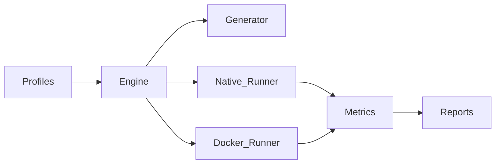

# Node.js Benchmark Suite

Open-source **engineering benchmark platform** for measuring modern JavaScript *development* performance.

Compare developer-loop cost across hardware, storage, operating systems, Docker setups, package managers, and project sizes—on **native Linux** and in **Docker**.

**Status:** M0–**M6 complete** — suite `1.0.0` (S18)  
**Suite version:** `1.0.0` (tag: `v1.0.0`)

**AI agents:** follow [AGENTS.md](AGENTS.md) (required reading and milestone workflow).

---

## What It Measures

| Area | Examples |
|------|----------|
| Toolchains | Node.js, TypeScript |
| Package managers | npm, pnpm, Yarn |
| Frameworks | Next.js (App Router fixtures) |
| Environments | Native Linux, Docker (bind mounts, named volumes, limits) |
| Scales | Deterministic small → large synthetic projects |

This is **not** a web application, demo, or HTTP load tester. It is a CLI laboratory that emits machine-readable and human-readable reports.

---

## Current capabilities

| Command | Status |
|---------|--------|
| `jsbench version` | Available |
| `jsbench help` | Available |
| `jsbench doctor` | Available |
| `jsbench validate-profile <path\|id>` | Available |
| `jsbench run --profile <path\|id> --dry-run` | Available |
| `jsbench run --profile <path\|id>` | Available (native + Docker) |
| `jsbench generate --template <id>` | Available (`fixture-lib`, `node-ts-lib`, `nextjs-app`) |
| `jsbench list-profiles` | Available |
| `report` | Re-render Markdown/HTML from a run directory |
| `report diff` | Compare two runs → `diff.md` + `diff.json` |

Also available as a library via package exports: config, profiles, metrics, native runner, reporting, `executeRun` / `runCli`.

---

## M1 usage (native smoke)

Requires **Node.js ≥ 20** and **pnpm** (see `packageManager` in `package.json`).

```bash
corepack enable
pnpm install
pnpm lint && pnpm typecheck && pnpm test && pnpm build

# Prerequisites
node dist/cli.js doctor

# Official smoke profile (id resolves under ./profiles)
node dist/cli.js validate-profile native-smoke
node dist/cli.js run --profile native-smoke

# Reports land under ./reports/<run-id>/ (run.json + summary.md + index.html)
```

What `native-smoke` does:

1. Resolves `profiles/native-smoke.yaml`
2. Copies `fixtures/native-smoke/` into a run workspace under `generated/`
3. Runs `node index.js` via `raw.command` (no package-manager install)
4. Writes `reports/<run-id>/run.json`, `summary.md`, and `index.html`

Profile ids (e.g. `native-smoke`) and file paths both work for `--profile` / `validate-profile`.

---

## M2 usage (install/build matrix)

Requires **npm** and **pnpm** on `PATH` for the built-in matrix (Yarn supported via adapters when selected).

```bash
node dist/cli.js list-profiles
node dist/cli.js validate-profile install-build-matrix
node dist/cli.js run --profile install-build-matrix --dry-run

# Full run (network install + tsc build × npm/pnpm) — not in default CI
node dist/cli.js run --profile install-build-matrix
```

Optional slow tests (same path, gated):

```bash
JSBENCH_SLOW_TESTS=1 pnpm test:slow
```

```bash
# Generate a TypeScript library workspace
node dist/cli.js generate --template node-ts-lib --size tiny --seed 1

# Generate a Next.js App Router workspace (materialize only — no next build in default CI)
node dist/cli.js generate --template nextjs-app --size tiny --seed 1
```

---

## M3 usage (Docker smoke)

Requires a running **Docker Engine** and `docker` on `PATH`.

```bash
node dist/cli.js doctor
node dist/cli.js validate-profile docker-smoke
node dist/cli.js run --profile docker-smoke --dry-run
node dist/cli.js run --profile docker-smoke
```

Compare with `native-smoke` (same fixture) using the checklist in [docs/06_DOCKER_BENCHMARK.md](docs/06_DOCKER_BENCHMARK.md) §14. Optional CI: workflow_dispatch with `docker_smoke: true`.

---

## M4 usage (reports)

```bash
# Re-render summary.md + index.html from an existing run (does not mutate run.json)
node dist/cli.js report ./reports/<run-id>

# Diff two runs
node dist/cli.js report diff ./reports/<runA> ./reports/<runB> --out ./diff-out
```

Enable optional collectors in a profile (`rusage`, `disk-usage`) and/or load plugins from config:

```yaml
# jsbench.config.yaml
plugins:
  - ./examples/plugins/sample-note-reporter.mjs
```

---

## Methodology (read before publishing results)

Honest comparisons require matching methodology. When citing or sharing results:

1. **Same profile digest** — record `profile.digest` from `run.json` (see `profiles/calibrated-digests.json` for built-ins).
2. **Cold vs warm** — stage `cache: cold|warm` and install reset policy must be stated.
3. **Network** — stages with `network: true` include registry time; do not mix with offline stages silently.
4. **Runner** — `native` vs `docker` (and Docker **mount** mode) are not interchangeable without disclosure.
5. **Pins** — fixture deps come from `templates/resolved-versions.json`; Docker images from `docker/resolved-images.json`.
6. **Attach `run.json`** — Markdown/HTML include a Citation section; prefer the immutable JSON as the source of truth.
7. **No winner banners** — the suite does not crown package managers or hardware.

Schema compatibility draft: [docs/18_SCHEMA_COMPATIBILITY.md](docs/18_SCHEMA_COMPATIBILITY.md).

### Official built-in profiles

| Profile id | Purpose | Notes |
|------------|---------|--------|
| `native-smoke` | Fast native path | No registry; default CI |
| `install-build-matrix` | npm + pnpm install/build | Network; optional slow CI |
| `docker-smoke` | Docker bind-mount smoke | Needs daemon; optional CI |
| `foundation-sample` | Loader / dry-run sample | Not a publishable smoke |

Dry-run any profile without executing stages:

```bash
node dist/cli.js run --profile native-smoke --dry-run
node dist/cli.js run --profile install-build-matrix --dry-run
node dist/cli.js run --profile docker-smoke --dry-run
```

---

## Quickstart (dev checks)

```bash
pnpm install
pnpm lint
pnpm typecheck
pnpm test
pnpm build

pnpm jsbench doctor
pnpm jsbench run --profile native-smoke --dry-run
```

Lint/format uses **Biome**. Optional config: copy `jsbench.config.example.yaml` → `jsbench.config.yaml`.

---

## Design at a Glance



- **Profiles** declare matrices and stages  
- **Generator** builds deterministic fixture apps (M2)  
- **Runners** execute on host or in containers  
- **Metrics / reporting** produce JSON, Markdown, and HTML artifacts  

Full architecture: [docs/03_ARCHITECTURE.md](docs/03_ARCHITECTURE.md)

---

## Documentation (source of truth)

| Doc | Topic |
|-----|-------|
| [AGENTS.md](AGENTS.md) | Operating manual for AI agents (workflow, DoD, stop rules) |
| [00 Overview](docs/00_PROJECT_OVERVIEW.md) | Vision and scope |
| [01 Goals](docs/01_PROJECT_GOALS.md) | Goals and success criteria |
| [02 Requirements](docs/02_REQUIREMENTS.md) | Functional / non-functional requirements |
| [03 Architecture](docs/03_ARCHITECTURE.md) | Modules, CLI, config, layout |
| [04 Generator](docs/04_GENERATOR_ENGINE.md) | Workload generation |
| [05 Native](docs/05_NATIVE_BENCHMARK.md) | Native Linux runner |
| [06 Docker](docs/06_DOCKER_BENCHMARK.md) | Docker runner |
| [07 Metrics](docs/07_METRICS_ENGINE.md) | Collectors and aggregates |
| [08 Reporting](docs/08_REPORTING.md) | Artifacts and diffs |
| [09 Version policy](docs/09_VERSION_POLICY.md) | How tool versions are selected |
| [10 Coding standard](docs/10_CODING_STANDARD.md) | Code and docs standards |
| [11 Dependency policy](docs/11_DEPENDENCY_POLICY.md) | Dependency governance |
| [12 Roadmap](docs/12_ROADMAP.md) | Milestones M0–M6 |
| [13 Tasks](docs/13_TASKS.md) | Implementation task tracker |
| [14 Changelog](docs/14_CHANGELOG.md) | Release history |
| [15 FAQ](docs/15_FAQ.md) | Common questions |
| [16 Contributing](docs/16_CONTRIBUTING.md) | How to contribute |
| [17 Implementation plan](docs/17_IMPLEMENTATION_PLAN.md) | Commit-sized slices S0–S18 |
| [18 Schema compatibility](docs/18_SCHEMA_COMPATIBILITY.md) | v1 contract draft (pre-1.0) |

---

## Repository Layout

```
nodejs-benchmark-suite/
├── docs/           # Specifications (authoritative)
├── src/            # TypeScript suite (single package)
├── schemas/        # JSON Schema for config + profiles
├── profiles/       # Built-in profiles (incl. native-smoke)
├── fixtures/       # Static workloads (pre-generator)
├── docker/         # Image policy pins (+ future Dockerfiles)
├── templates/      # Workload templates (fixture-lib, node-ts-lib, nextjs-app)
├── packages/       # Deferred monorepo split (see packages/README.md)
├── docker/         # Runner images / compose (future)
├── scripts/        # Maintainer scripts (future)
├── tests/          # Integration tests (future)
├── generated/      # Gitignored workspaces
└── reports/        # Gitignored run outputs
```

---

## Roadmap (summary)

| Milestone | Focus |
|-----------|--------|
| **M0** | Planning & specs — done |
| **Foundation (S1–S3)** | Tooling, config, profile validation — done |
| **M1 (S4–S9)** | Native MVP (`doctor`, `run`, `native-smoke`) — **done** |
| **M2 (S10–S12)** | Generator + package-manager matrices — **done** |
| **M3 (S13)** | Docker runner + mount modes — **done** |
| **M4 (S14)** | HTML reports + run diffs — **done** |
| **M5 (S15–S16)** | Plugins + collectors + hardening — **done** |
| **M6 (S17–S18)** | Calibration + release `1.0.0` — **done** |

Details: [docs/12_ROADMAP.md](docs/12_ROADMAP.md) · Tasks: [docs/13_TASKS.md](docs/13_TASKS.md) · Slices: [docs/17_IMPLEMENTATION_PLAN.md](docs/17_IMPLEMENTATION_PLAN.md)

---

## License

[MIT](LICENSE)
