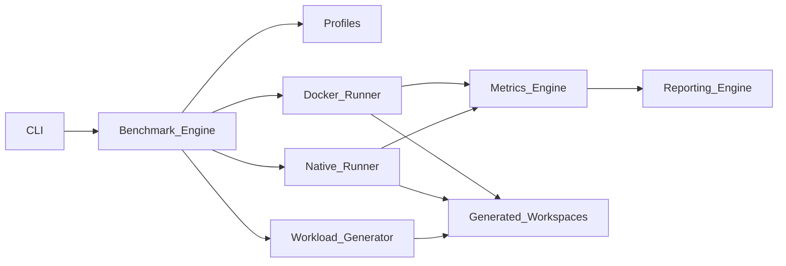

# Project Overview

**Project:** Node.js Benchmark Suite  
**Status:** S18 / M6 exit complete — suite `1.0.0`
**Document type:** Source of truth  
**Last updated:** July 2026

---

## What This Is

An open-source **engineering benchmark platform** for measuring modern JavaScript *development* performance.

It quantifies how long common developer workflows take under controlled, reproducible conditions across:

- Host hardware and storage
- Operating systems
- Native Linux execution
- Docker and container configurations
- Package managers (`npm`, `pnpm`, `Yarn`)
- Runtimes (Node.js)
- Frameworks and toolchains (Next.js, TypeScript)
- Synthetic project sizes and shapes

This is **not** a web application, demo site, marketing page, or application-runtime load tester. It is a CLI-driven laboratory for comparing development-environment throughput and latency.

---

## Problem Statement

Teams choose machines, disks, package managers, and Docker setups based on anecdotes. Existing tools often:

- Measure application *runtime* (HTTP RPS, SSR latency) rather than *developer loop* cost
- Mix uncontrolled network variance into “install” timings
- Lack comparable native vs Docker matrices
- Omit environment fingerprints needed to interpret results
- Are one-off shell scripts without schemas, profiles, or report contracts

This suite replaces ad-hoc scripts with a versioned, extensible benchmark engine, deterministic workloads, and machine-readable reports.

---

## Primary Audiences

| Audience | Use |
|----------|-----|
| Individual developers | Compare laptop/desktop/NAS/CI hosts for JS work |
| Platform / DevOps engineers | Validate Docker volume mounts, base images, and CI runners |
| Hardware reviewers | Publish comparable JS-dev scores across devices |
| Package-manager maintainers | Reproduce install/resolution regressions |
| Open-source contributors | Add profiles, collectors, and runners without forking the core |

---

## In Scope (v1 Intent)

- Native Linux benchmarking
- Docker benchmarking (bind mounts, named volumes, resource limits)
- Node.js toolchain operations
- Package managers: npm, pnpm, Yarn
- Next.js project generation and production builds
- TypeScript typecheck and emit paths
- Synthetic multi-size workloads (small / medium / large)
- Structured metrics, JSON/Markdown/HTML reports
- Benchmark profiles as declarative configuration
- Extensible runner and collector plugins

## Explicitly Out of Scope (v1)

- Browser / Lighthouse / Core Web Vitals suites
- Production traffic simulation or APM
- Non-JS languages as first-class targets
- Hosted SaaS result dashboards (local reports only)
- Guaranteeing identical absolute times across unrelated machines without normalization metadata
- Replacing micro-benchmarks such as `benchmark.js` for algorithm timing

---

## Design Pillars

1. **Reproducibility** — Same profile + same environment fingerprint ⇒ comparable runs.
2. **Isolation** — Workloads run in clean workspaces; suite state never contaminates results.
3. **Comparability** — Shared schemas for metrics, environments, and reports.
4. **Honesty** — Network-dependent phases are labeled; cold/warm caches are explicit.
5. **Extensibility** — New runners, collectors, and profiles without core rewrites.
6. **Operator clarity** — CLI-first UX; docs are the contract for implementers.

---

## High-Level System Shape

---

## Repository Role of This Document Set

Everything under `docs/` is the **permanent specification** until implementation begins. Implementation must follow these documents. When behavior and docs diverge, update docs in the same change set.

| Doc | Topic |
|-----|-------|
| [../AGENTS.md](../AGENTS.md) | AI agent operating manual (workflow) |
| [01_PROJECT_GOALS.md](01_PROJECT_GOALS.md) | Goals, non-goals, success criteria |
| [02_REQUIREMENTS.md](02_REQUIREMENTS.md) | Functional and non-functional requirements |
| [03_ARCHITECTURE.md](03_ARCHITECTURE.md) | Modules, boundaries, layout, config |
| [04_GENERATOR_ENGINE.md](04_GENERATOR_ENGINE.md) | Workload generation |
| [05_NATIVE_BENCHMARK.md](05_NATIVE_BENCHMARK.md) | Native Linux runner |
| [06_DOCKER_BENCHMARK.md](06_DOCKER_BENCHMARK.md) | Docker runner |
| [07_METRICS_ENGINE.md](07_METRICS_ENGINE.md) | Metrics collection and schemas |
| [08_REPORTING.md](08_REPORTING.md) | Report formats and aggregation |
| [09_VERSION_POLICY.md](09_VERSION_POLICY.md) | Toolchain version selection |
| [10_CODING_STANDARD.md](10_CODING_STANDARD.md) | Code and doc standards |
| [11_DEPENDENCY_POLICY.md](11_DEPENDENCY_POLICY.md) | Dependency governance |
| [12_ROADMAP.md](12_ROADMAP.md) | Milestones and phases |
| [13_TASKS.md](13_TASKS.md) | Implementation task tracking |
| [14_CHANGELOG.md](14_CHANGELOG.md) | Release history |
| [15_FAQ.md](15_FAQ.md) | Frequently asked questions |
| [16_CONTRIBUTING.md](16_CONTRIBUTING.md) | Contribution guide |
| [17_IMPLEMENTATION_PLAN.md](17_IMPLEMENTATION_PLAN.md) | Commit-sized implementation slices |
| [18_SCHEMA_COMPATIBILITY.md](18_SCHEMA_COMPATIBILITY.md) | Schema v1 compatibility (frozen at 1.0) |

---

## Current Phase

**M0–M6 are complete** (suite `1.0.0`). Post-1.0 themes: [12_ROADMAP.md](12_ROADMAP.md) §3 · parking lot in [13_TASKS.md](13_TASKS.md).
