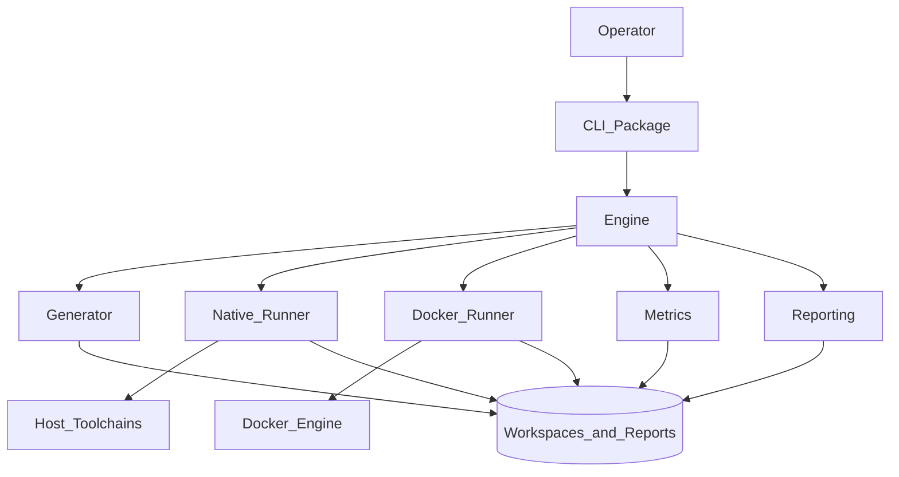
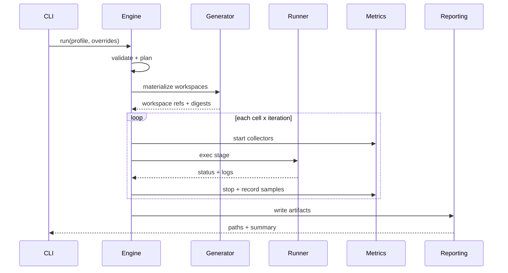
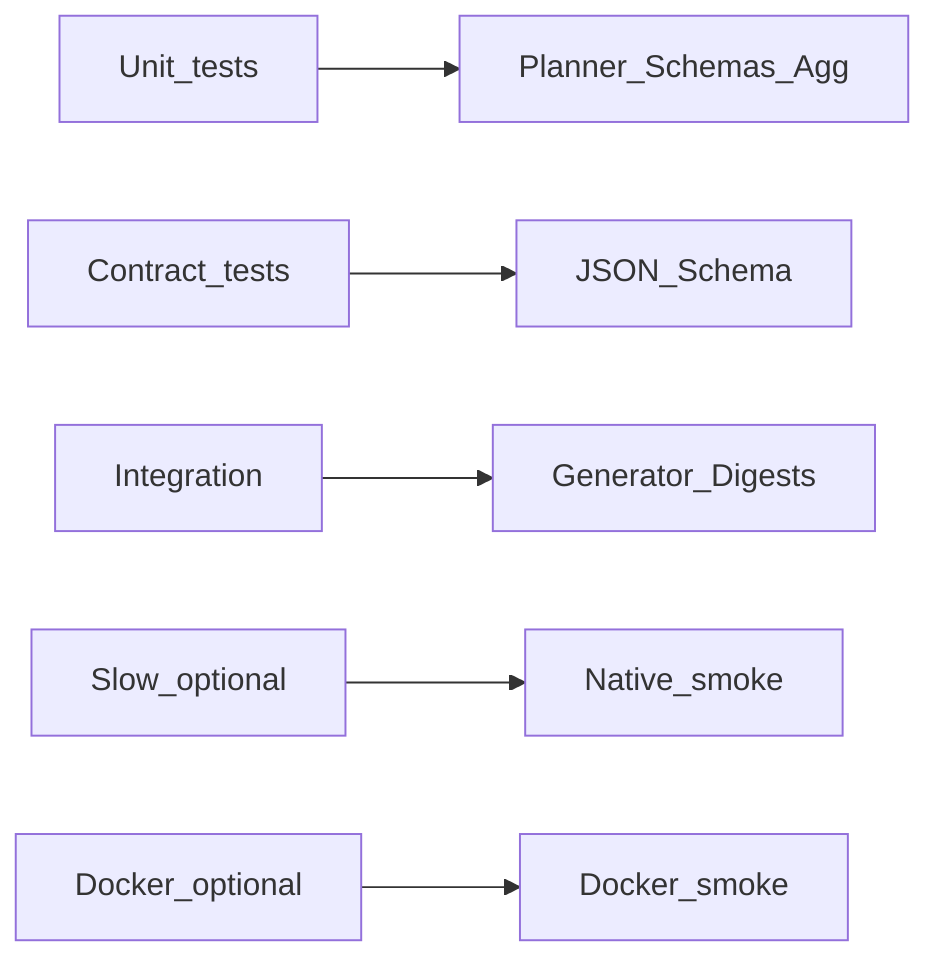

# Architecture

**Status:** Active — M6 / `1.0.0` shipped; post-1.0 extensions follow roadmap backlog  
**Last updated:** July 2026

---

## 1. Architectural Intent

Build a **modular CLI benchmark platform** with clear boundaries:

- **Profiles** declare *what* to measure.
- **Generator** creates *fixtures*.
- **Engine** plans and orchestrates *runs*.
- **Runners** execute *where* (native / Docker).
- **Collectors** measure *how much*.
- **Reporters** publish *artifacts*.

The suite is TypeScript-first, Node.js-hosted, Linux-primary. Packages may live in a small monorepo under `packages/` or a structured `src/` tree; either layout is acceptable if module boundaries below are preserved.

---

## 2. Context Diagram



---

## 3. Module Boundaries

### 3.1 `cli`

**Responsibility:** argv parsing, command routing, human UX, exit codes.

**Must not:** Implement timing logic, Docker APIs, or report math beyond calling libraries.

### 3.2 `core` / `engine`

**Responsibility:**

- Load and validate profiles + user config
- Expand matrices into a `RunPlan`
- Coordinate generate → execute → collect → finalize
- Manage run ids, manifests, and failure policy

**Must not:** Shell out to package managers directly (delegate to runners/adapters).

### 3.3 `generator`

**Responsibility:** Materialize templates into workspace trees; compute content digests.

**Must not:** Run installs or builds.

### 3.4 `runners/native`

**Responsibility:** Process execution on host, env scrubbing, working directories, PATH resolution.

### 3.5 `runners/docker`

**Responsibility:** Image ensure/pull policy, container create/start, mounts, resource limits, log capture.

### 3.6 `adapters/package-managers`

**Responsibility:** Map abstract stages (`install`, `build`, …) to concrete argv for npm / pnpm / Yarn.

### 3.7 `metrics`

**Responsibility:** Collectors, clocks, aggregation, schema types.

### 3.8 `reporting`

**Responsibility:** Serialize run artifacts; render Markdown/HTML; diff runs.

### 3.9 `profiles` + `templates` (data)

**Responsibility:** Versioned declarative assets—not TypeScript modules with side effects.

---

## 4. Internal Data Flow



---

## 5. Key Types (Conceptual)

```typescript
// Conceptual — not implementation code

type Profile = {
  schemaVersion: number;
  id: string;
  description?: string;
  workload: WorkloadSpec;
  matrix: MatrixSpec;
  stages: StageSpec[];
  runner: RunnerSpec;
  metrics?: MetricsSpec;
  reporting?: ReportingSpec;
  iterations: IterationSpec;
};

type RunPlan = {
  runId: string;
  profileDigest: string;
  cells: MatrixCell[];
  stages: ResolvedStage[];
  iterations: number;
  warmup: number;
};

type StageResult = {
  cellId: string;
  stageId: string;
  iteration: number;
  iterationKind: "warmup" | "measured";
  status: "passed" | "failed" | "skipped";
  durationMs: number;
  metrics: Record<string, number>;
  artifacts?: { stdout?: string; stderr?: string };
};

type RunArtifact = {
  suiteVersion: string;
  createdAt: string;
  environment: EnvironmentFingerprint;
  profile: { id: string; digest: string };
  results: StageResult[];
  aggregates: AggregateTable;
};
```

Exact JSON Schema files will live under `packages/schemas` or `src/schemas` during implementation.

---

## 6. Repository Layout (Target)

```
nodejs-benchmark-suite/
├── README.md
├── LICENSE
├── package.json                 # workspace root (implementation phase)
├── jsbench.config.yaml          # optional local defaults
├── docs/                        # specification (this tree)
├── profiles/                    # built-in benchmark profiles
├── templates/                   # workload templates
├── benchmarks/                  # optional named benchmark suites composing profiles
├── packages/                    # TS packages (cli, core, generators, ...)
│   ├── cli/
│   ├── core/
│   ├── generator/
│   ├── runners-native/
│   ├── runners-docker/
│   ├── metrics/
│   ├── reporting/
│   └── schemas/
├── src/                         # alternative single-package layout if monorepo deferred
├── docker/                      # Dockerfiles, compose fragments for runners
├── scripts/                     # maintainer scripts (release, schema gen)
├── tests/                       # cross-package integration tests
├── generated/                   # gitignored workspaces
├── reports/                     # gitignored run outputs
├── .github/workflows/           # CI
└── .vscode/                     # recommended editor settings
```

**Rule:** Empty scaffold dirs may exist before code; do not commit generated workloads or reports.

---

## 7. Configuration System

### 7.1 Layers (highest precedence first)

1. CLI flags (`--iterations`, `--runner native`, …)
2. Environment variables (`JSBENCH_OUTPUT_DIR`, …)
3. Project file `jsbench.config.yaml`
4. User config (`$XDG_CONFIG_HOME/jsbench/config.yaml`)
5. Profile document
6. Built-in defaults

### 7.2 Global config keys (illustrative)

```yaml
outputDir: ./reports
workspaceRoot: ./generated
defaultRunner: native
toolchains:
  node: policy:lts-active   # resolved at runtime — see version policy
strictDoctor: true
redactEnv:
  - ".*TOKEN.*"
  - ".*SECRET.*"
  - ".*PASSWORD.*"
```

### 7.3 Profile document shape (illustrative)

```yaml
schemaVersion: 1
id: nextjs-install-build
description: Install + production build matrix for Next.js fixtures
workload:
  template: nextjs-app
  size: medium
matrix:
  packageManager: [npm, pnpm, yarn]
  runner: [native, docker]   # axis selects runner; per-runner options below
stages:
  - id: install
    action: packageManager.install
    cache: cold
  - id: build
    action: project.build
iterations:
  warmup: 1
  measured: 3
runner:
  # Defaults applied when matrix selects each mode
  native: {}
  docker:
    imagePolicy: node-lts-bookworm
    mount: named-volume
metrics:
  collectors: [wall, rusage]
reporting:
  formats: [json, markdown]
```

For single-runner profiles (e.g. M1 smoke), omit the `runner` matrix axis and set `runner.type: native` or `runner.type: docker` explicitly (see [06_DOCKER_BENCHMARK.md](06_DOCKER_BENCHMARK.md)).

---

## 8. CLI Architecture

| Command | Behavior |
|---------|----------|
| `jsbench doctor` | Check Node, package managers, Docker, disk, permissions |
| `jsbench list-profiles` | List built-in and discovered profiles |
| `jsbench validate-profile <path>` | Schema + semantic validation |
| `jsbench generate --profile <id>` | Materialize workloads only |
| `jsbench run --profile <id>` | Full plan execution |
| `jsbench report <run-id>` | Re-render reports from raw JSON |
| `jsbench report diff <a> <b>` | Compare aggregates |
| `jsbench version` | Suite version + optional dependency banner |

Implementation note: use a typed CLI framework consistent with [11_DEPENDENCY_POLICY.md](11_DEPENDENCY_POLICY.md).

---

## 9. Extensibility Model

### v1 — In-process plugins (S15)

- Register `Collector` / `Reporter` implementations via `plugins: [path, …]` in suite config.
- Plugins are local TypeScript/JavaScript ESM modules resolved from path (`default` or `plugin` export).
- Built-in collectors: `wall`, `rusage`, `disk-usage`. Built-in Markdown/HTML reporters remain core; plugins add extras.
- Profile `metrics.collectors` selects which collectors run (wall is always ensured).

### Later

- `StageAction` plugins
- Worker-thread collectors
- Remote runner agents
- Result upload adapters (opt-in)

**Stability rule:** Profile schema and `RunArtifact` schema are semver-governed public contracts.

---

## 10. Error Handling & Exit Codes

| Code | Meaning |
|------|---------|
| 0 | Success |
| 1 | Unclassified runtime error |
| 2 | Invalid profile/config |
| 3 | Doctor / prerequisite failure |
| 4 | Stage command failure |
| 5 | Docker error |
| 6 | Partial run completed with failures (`--continue-on-error`) |

---

## 11. Security Boundaries

- Prefer `spawn` with argv arrays; avoid `shell: true`.
- `shell` / `unsafe.shell` profile actions are **rejected** (v1 has no opt-in shell mode).
- CI/unit audit (`auditShellForbid`) fails if production `src/` enables `shell: true`; spawn entrypoints must set `shell: false`.
- Docker host mounts must stay under the configured `workspaceRoot` (`assertSafeHostMountPath`); mounting `$HOME` or system paths (`/etc`, `/dev`, …) is forbidden.
- Report redaction applied to captured env snapshots.

---

## 12. Testing Strategy (Architecture View)



Default CI: unit + contract + generator integration.  
Nightly/manual: native smoke + Docker smoke.

---

## 13. Documentation Standards (Architecture)

- Specs use numbered sections and stable heading anchors.
- Mermaid for structure; avoid screenshots as source of truth.
- Cross-link related docs instead of duplicating schemas.
- When changing a public schema, update docs and `14_CHANGELOG.md` in the same PR.

---

## 14. Related Specs

- Generator: [04_GENERATOR_ENGINE.md](04_GENERATOR_ENGINE.md)
- Native: [05_NATIVE_BENCHMARK.md](05_NATIVE_BENCHMARK.md)
- Docker: [06_DOCKER_BENCHMARK.md](06_DOCKER_BENCHMARK.md)
- Metrics: [07_METRICS_ENGINE.md](07_METRICS_ENGINE.md)
- Reporting: [08_REPORTING.md](08_REPORTING.md)
