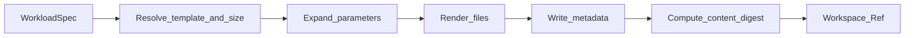

# Workload Generator Engine

**Status:** Partial — core + templates (S11, S23 Tailwind) + `run` materialize (S12); Docker S13
**Last updated:** July 2026

---

## 1. Purpose

The generator creates **deterministic fixture projects** used as benchmark subjects. It does not install dependencies or compile code. Its outputs are ordinary filesystem trees consumed by runners.

Goals:

- Controllable project *size* and *shape*
- Stable content digests for reproducibility
- Templates that resemble real Node/TS/Next.js apps without shipping huge vendor trees

---

## 2. Concepts

| Term | Meaning |
|------|---------|
| **Template** | A parameterized project skeleton under `templates/` |
| **Size preset** | Named scale (`tiny`, `small`, `medium`, `large`) mapping to numeric knobs |
| **Seed** | Integer that drives deterministic naming/content variation |
| **Workspace** | Concrete directory produced for one matrix cell |
| **Content digest** | Hash of normalized file contents (paths + bytes), excluding volatile files |

---

## 3. Generator Pipeline



### Steps (implemented — S10)

1. **Resolve** template id → `template.manifest.yaml` (Ajv-validated).
2. **Expand** size preset → `{ fileCount, packageCount, tsComplexity, dependencySet }` (params override).
3. **Render** copy `skeleton/` then emit seeded modules under `src/generated/` (custom TS renderer; no Handlebars dependency).
4. **Digest** tree (excludes volatile paths; excludes `.jsbench-workspace.json`).
5. **Stamp** `.jsbench-workspace.json` with generator version, seed, params, digest.

Library: `materialize` / `createGenerator` in `src/generator/`.  
CLI: `jsbench generate --template node-ts-lib --size tiny --seed 1 [--out path]`.

---

## 4. WorkloadSpec (Profile Fragment)

```yaml
workload:
  template: node-ts-lib         # also: nextjs-app, fixture-lib
  size: tiny
  seed: 1
  params:                       # overrides size preset
    fileCount: 4
```

Explicit params always win over size defaults.

---

## 5. Size Presets

Defaults live in `src/generator/size-presets.ts`. Templates may override in `template.manifest.yaml` `sizes:`.

| Preset | Intent |
|--------|--------|
| `tiny` | Smoke / CI |
| `small` | Laptop quick compare |
| `medium` | Default published comparisons |
| `large` | Stress install/typecheck/build |
| `xlarge` | Optional soak |

---

## 6. Template Contract

Each template directory:

```
templates/<template-id>/
├── template.manifest.yaml
├── skeleton/                 # static files copied as-is
├── partials/                 # optional (unused by current renderer)
└── README.md                 # human notes (not copied)
```

Shared offline pins: `templates/resolved-versions.json`.

JSON Schema: `schemas/template-manifest.schema.json`.

### Rules

- No `node_modules` inside templates.
- Lockfiles are **not** pre-baked unless a profile explicitly requests `lockfileMode: committed-fixture` (advanced).
- Dependency versions may use `policy:…` placeholders; default materialize pins them from `templates/resolved-versions.json` (`createPinResolver`). Refresh pins deliberately and re-baseline digests.

---

## 7. Initial Template Set

| Template id | Description | Status |
|-------------|-------------|--------|
| `fixture-lib` | Minimal TS library for generator core | **S10** |
| `node-ts-lib` | TypeScript library with `tsc` build | **S11** |
| `nextjs-app` | Next.js App Router + TS | **S11** |
| `nextjs-app-tailwind` | Next.js + Tailwind CSS v4 | **S23** |
| `pnpm-workspace` | Multi-package workspace | deferred (parking lot) |

---

## 8. Determinism Rules

1. Same `(template, size, seed, params, policy-resolution-set)` ⇒ same digest.
2. File path order in digest is sorted by POSIX path.
3. Normalize newlines to `\n` before hashing.
4. Exclude from digest: `.git`, `node_modules`, `.next`, `coverage`, `dist`, logs, OS junk, **`.jsbench-workspace.json`**.
5. Include generated `package.json` and all source fixtures.
6. Record params + digest in workspace metadata.

---

## 9. Workspace Layout on Disk

```
generated/
  <run-id>/
    <cell-id>/
      .jsbench-workspace.json
      package.json
      ...project files...
```

Manual generates default to `generated/manual/<template>-<size>-s<seed>/` unless `--out` is set.

---

## 10. Generator API

```typescript
interface Generator {
  materialize(input: MaterializeInput): Promise<WorkspaceRef>;
  digest(workspacePath: string): Promise<string>;
  clean(workspacePath: string, mode: CleanMode): Promise<void>;
}
```

Implemented as `createGenerator()` / `materialize` / `digestWorkspace` / `cleanWorkspace`.

---

## 11. Failure Modes

| Failure | Response |
|---------|----------|
| Unknown template | Exit 2 before run |
| Size not supported | Exit 2 |
| Render error | Fail cell; respect continue-on-error |
| Digest mismatch in lock mode | Fail fast (later) |
| Disk full | Exit 1 with actionable message |

---

## 12. Testing the Generator

- Digest stability tests across two consecutive materializations — **done (S10)**
- Property test: changing seed changes digest — **done (S10)**
- Property test: excluded dirs do not affect digest — **done (S10)**
- Snapshot tests for `tiny` renders of each full template — **done (S11, S23)**

---

## 13. Non-Responsibilities

- Network installs
- Choosing package manager
- Timing
- Docker image builds
- Wiring `run` to auto-generate from template ids — **done (S12)** via `prepareWorkspace` → `materialize`
