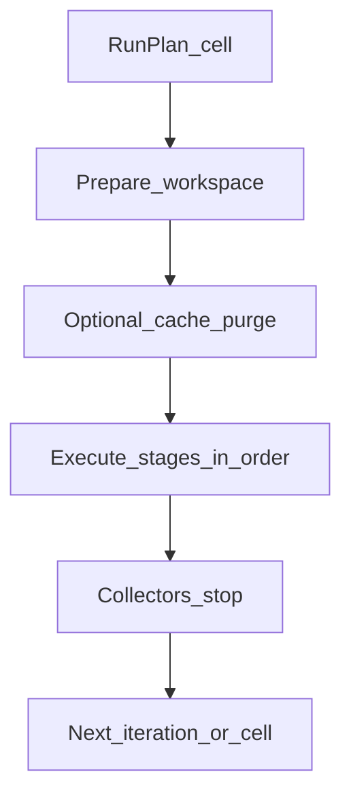

# Native Benchmark Architecture

**Status:** Partial — native runner + PM adapters (S12); Docker S13  
**Last updated:** July 2026

---

## 1. Purpose

The **native runner** executes benchmark stages directly on the host Linux OS using locally installed (or version-managed) toolchains. It is the primary path for:

- Comparing machines and disks without container I/O overhead
- Establishing baselines that Docker results can be compared against
- Fast iteration during suite development

---

## 2. Design Principles

1. **One cell, one workspace** — no sharing `node_modules` across matrix cells unless a profile explicitly tests cache reuse.
2. **Explicit caches** — cold vs warm is a stage parameter, never accidental.
3. **Honest PATH** — record which binaries were used (`realpath`, version flags).
4. **Minimal ambient influence** — scrub irrelevant env; keep `HOME`/`LANG`/`http_proxy` policy documented.
5. **No silent network** — if install hits the registry, the stage is tagged `network: true`.

---

## 3. Execution Model



### Per-iteration lifecycle

1. Apply reset policy (`purge node_modules`, clear tooling caches, etc.).
2. Start collectors (wall clock always; rusage optional).
3. `spawn` stage command with argv, cwd = workspace, timeout from profile.
4. On completion: stop collectors, persist `StageResult`, retain logs.
5. If failure: abort cell or continue per flags.

### Process supervisor (implemented — S6)

Library API: `runProcess` in `src/runners/native/process-runner.ts`.

| Concern | Behavior |
|---------|----------|
| Argv | `command` + `args[]`; `shell: false` always |
| Env | Scrubbed allowlist via `scrubEnv` (see §13) |
| Logs | `logDir` / `{logPrefix}.out.log` and `.err.log` |
| Timeout | Detached child (new process group); `kill(-pid, SIGKILL)` on expiry |
| Timing | Wall `durationMs` via `WallCollector` |
| Result | `passed` \| `failed` \| `timeout` with exit code, signal, paths |

---

## 4. Toolchain Discovery

`jsbench doctor` (S8; release-polish human summary) and the native runner share resolution logic. Helpers live in `src/runners/native/discover.ts` (`discoverNativeToolchains`). Doctor treats **Node.js ≥ 20** as required and package managers / Docker as optional, with actionable fixes when missing. Invoke as `pnpm jsbench doctor` from a clone.

| Tool | Discovery |
|------|-----------|
| Node.js | `JSBENCH_NODE`, else `process.execPath`, else `command -v node` equivalent on `PATH` |
| npm | `JSBENCH_NPM`, else binary beside Node, else `PATH` |
| pnpm | `command -v pnpm` or corepack (later) |
| Yarn | `command -v yarn` or corepack (later) |
| Corepack | Preferred for activating pm versions per [09_VERSION_POLICY.md](09_VERSION_POLICY.md) |

Resolved binary paths and `version` command outputs are written into `EnvironmentFingerprint.toolchains` (S7+).

---

## 5. Stage Actions (Native Mapping)

### 5.1 S8 executable action

| Action | Support |
|--------|---------|
| `raw.command` | **Yes** — requires `command` + optional `args`. `node` / `$NODE` → `process.execPath` |
| `packageManager.*` / `project.*` | **S12** — npm / pnpm / Yarn Berry adapters |

```yaml
stages:
  - id: noop
    action: raw.command
    command: node
    args: ["-e", "process.exit(0)"]
    timeoutMs: 10000
```

### 5.2 Package-manager mapping (planned)

Abstract actions map through package-manager adapters:

| Action | npm (illustrative) | pnpm | Yarn Berry |
|--------|--------------------|------|------------|
| `packageManager.install` | `npm ci` or `npm install` | `pnpm install` | `yarn install` |
| `packageManager.install.cold` | Same after cache purge | Same | Same |
| `project.build` | `npm run build` | `pnpm run build` | `yarn build` |
| `project.typecheck` | `npm run typecheck` | `pnpm run typecheck` | `yarn typecheck` |
| `project.test` | `npm test` | `pnpm test` | `yarn test` |

Profiles specify whether lockfile-based install (`ci`) is required. Generators that do not emit lockfiles use non-`ci` install and document variance risk.

S6 provides **raw argv passthrough**; S8 wires `raw.command`; **S12** adds package-manager adapters and full matrices.

---

## 6. Cache Control

### Cold install

Before stage:

- Delete workspace `node_modules`
- Optionally clear tool global stores **only if profile requests** (`pnpm store`, Yarn cache, npm cache)—default is **workspace-local cold** without nuking user global caches
- Prefer isolated cache dirs via env (`npm_config_cache`, `PNPM_STORE_DIR`, `YARN_CACHE_FOLDER`) pointing under the run directory (`extraEnv` on `runProcess`)

### Warm install / build

- Keep `node_modules` and build caches (e.g. `.next/cache`) between iterations as declared

**Recommendation:** Default profiles use **run-scoped cache directories** under `generated/<run-id>/_caches/<cell-id>/` to avoid polluting the operator’s home caches and to improve reproducibility.

---

## 7. Environment Fingerprint (Native Fields)

```yaml
environment:
  mode: native
  os:
    platform: linux
    release: "..."
    distro: "..."      # from /etc/os-release when available
  cpu:
    model: "..."
    coresLogical: 8
    arch: x64
  memory:
    totalBytes: 0
  disk:
    workspaceFs: ext4  # best-effort
    workspacePath: /path
  toolchains:
    node: { path: "...", version: "..." }
    npm: { path: "...", version: "..." }
    # ...
```

---

## 8. Isolation & Concurrency

- **Default concurrency:** `1` (serial cells) to reduce noisy-neighbor effects on laptops.
- Profiles may set `concurrency: N` for machines dedicated to benchmarking; reports must show concurrency.
- Use filesystem locks on workspace paths to prevent accidental double runs.

---

## 9. Timeouts & Resource Caps

- Each stage has `timeoutMs` (profile or default).
- Soft memory guidance via docs; hard cgroup limits are Docker’s job unless native cgroup tooling is added later.
- On timeout: kill process group, mark stage `timeout` / failed, capture partial metrics and logs.

---

## 10. Logging

- Stage stdout/stderr written under `reports/<run-id>/logs/<cell-id>/<stage>-<iteration>.{out,err}.log` (orchestration in S7–S8; S6 accepts any `logDir` / `logPrefix`)
- Truncation policy for huge logs (keep tail + size note) — later

---

## 11. Failure Handling

| Condition | Behavior |
|-----------|----------|
| Missing binary | Fail doctor / fail run (exit 3); `TOOL_NOT_FOUND` |
| Non-zero stage exit | Fail stage (exit 4) |
| Timeout | `status: timeout`; process group killed |
| Workspace not found | Fail cell |
| Permission error | Fail with path guidance |

---

## 12. Native vs Docker Comparability

When comparing native and Docker:

- Use the **same profile id**, workload digest, and package manager axis
- Expect Docker bind-mounts on some filesystems to be slower—this is a feature of the benchmark, not noise
- Prefer matching Node major via version policy on both sides
- Document whether Docker used CPU pinning / memory limits

---

## 13. Security Notes / Env Allowlist

- Do not inherit the full user environment by default; start from a scrubbed allowlist.
- **Always allowed (when set):** `PATH`, `HOME`, `USER`, `LOGNAME`, `LANG`, `LC_ALL`, `LC_CTYPE`, `CI`, `TMPDIR`, `TMP`, `TEMP`, `TERM`
- **Proxy vars (opt-in via `includeProxies`):** `http_proxy`, `https_proxy`, `HTTP_PROXY`, `HTTPS_PROXY`, `no_proxy`, `NO_PROXY`, `ALL_PROXY`, `all_proxy`
- Callers may merge `extraEnv` after scrubbing (e.g. run-scoped cache dirs).
- Never run profile-provided shell strings — `shell` / `unsafe.shell` actions are rejected (S16).
- Production sources are audited for `shell: true` (`auditShellForbid`).

---

## 14. Orchestration overhead (NFR-03)

Target: suite wrapper cost &lt; **1%** of stage duration for stages lasting ≥ **5s**.

Use `measureOrchestrationOverhead()` / `isOrchestrationOverheadWithinBudget()` from `src/security/orchestration-overhead.ts` when checking regressions. Wall timing for stages remains the process/docker exec timer (collector wrappers for `rusage` / `disk-usage` run outside that timer for disk walks).

---

## 15. Implementation Checklist

- [x] Process supervisor with process-group kill (S6)
- [x] Scrubbed env allowlist (S6)
- [x] Log file capture (S6)
- [x] Node/npm/pnpm/yarn discovery helpers (S6/S12)
- [x] Run-scoped package-manager caches (S12)
- [x] Fingerprint collectors for CPU/mem/os (S7)
- [x] Engine + CLI `run` / `doctor` for `raw.command` (S8)
- [x] Integration smoke profile `native-smoke` (S9)
- [x] Adapter interface for npm/pnpm/Yarn (S12)
- [x] Full cartesian matrix + `install-build-matrix` (S12)
- [x] Shell forbid + action rejection (S16)
- [x] Orchestration overhead helper (S16)
