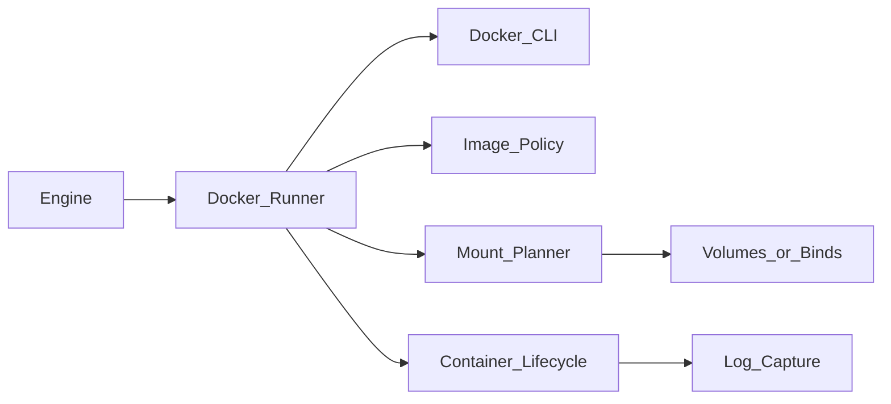

# Docker Benchmark Architecture

**Status:** Partial — CLI runner + bind/named-volume (S13); docker-stats collector (S25); Compose later  
**Last updated:** July 2026

---

## 1. Purpose

The **Docker runner** measures JavaScript development workflows *inside containers* and across common volume strategies. It answers questions such as:

- How much slower is `npm install` / `next build` in Docker vs native on this host?
- Do named volumes beat bind mounts on this filesystem?
- How do CPU/memory limits affect build times?

---

## 2. Design Principles

1. **Host orchestrates, container executes** — the suite CLI runs on the host; timed commands run in containers.
2. **Mount mode is a first-class axis** — never hide I/O strategy.
3. **Image identity is recorded** — tag + resolved digest when available.
4. **Ephemeral by default** — containers removed after stages unless debugging retention is set.
5. **Same stage semantics as native** — adapters produce the same abstract actions; only the execution substrate changes.

---

## 3. Components



v1 uses the Docker CLI (`docker create` / `start` / `exec` / `rm`). Library: `src/runners/docker/`.

---

## 4. Image Policy

Images are **not** hard-pinned to numeric tags in documentation. Resolution follows [09_VERSION_POLICY.md](09_VERSION_POLICY.md).

Offline pins: `docker/resolved-images.json` (e.g. `node-lts-bookworm-slim` → `node:22-bookworm-slim`).  
`exact:<ref>` bypasses the pin file.

```yaml
runner:
  type: docker
  docker:
    imagePolicy: node-lts-bookworm-slim
    pull: if-missing   # always | if-missing | never
    workdir: /workspace
```

### Fingerprint fields

- `imageRef` (as requested)
- `imageDigest` (resolved when daemon provides RepoDigests)
- `containerRuntime` (Docker server version)
- `mount`, `cpus`, `memory`, `pidsLimit`, `toolProvisioning: image`

---

## 5. Mount Modes

| Mode | Status | Description |
|------|--------|-------------|
| `bind` | **S13** | Host workspace bind-mounted at workdir |
| `named-volume` | **S13** | Volume populated from host tree, then mounted |
| `copy-in` | Later | `docker cp` into writable layer |
| `tmpfs` | Later | In-memory workspace |

Matrix axis `mount` overrides `runner.docker.mount`.

Host paths used for bind mounts and named-volume population must pass `assertSafeHostMountPath`: they must lie under the suite `workspaceRoot`, and must not be `$HOME` or sensitive system prefixes (`/etc`, `/dev`, `/proc`, …) (S16).

---

## 6. Resource Controls

```yaml
runner:
  docker:
    cpus: 4
    memory: 8g
    pidsLimit: 4096
```

Applied via `docker create` flags and recorded in the fingerprint.

---

## 7. Container Lifecycle

1. Ensure image (untimed)
2. Prepare host workspace (generator / fixture copy)
3. Create volume + populate if `named-volume` (untimed)
4. `docker create` + `start` with `sleep infinity` (untimed)
5. Timed `docker exec` per stage
6. Remove container (and volume per policy)

### Cleanup

| Setting | Behavior |
|---------|----------|
| `removeContainers: always` | Default |
| `removeContainers: on-success` | Keep failed containers for debug |
| `removeVolumes: true/false` | Default true for suite-created volumes |

---

## 8. Timing Boundaries

**Timed:** inner stage command via `docker exec`  
**Not timed:** pull, volume create/populate, container create/start

---

## 9. Smoke profile

`profiles/docker-smoke.yaml` — bind-mount `fixtures/native-smoke`, run `node index.js` in the container.

Default CI validates + dry-runs only. Optional: workflow_dispatch `docker_smoke: true`.

---

## 10. Comparability Checklist

For publishable native↔Docker comparisons:

- [ ] Same profile digest (or paired native-smoke / docker-smoke fixtures)
- [ ] Same workload digest
- [ ] Same package manager (when using PM stages)
- [ ] Same Node major (policy-resolved)
- [ ] Mount mode stated
- [ ] CPU/memory limits stated
- [ ] Iteration stats included
- [ ] Host fingerprint included on both runs

---

## 11. Implementation Checklist

- [x] Image policy resolver (S13)
- [x] Mount planner (`bind` + `named-volume`) (S13)
- [x] `docker exec` timing wrapper (S13)
- [x] Host mount allowlist under `workspaceRoot` (S16)
- [x] Stats sampling (`docker stats` / cgroup) optional collector — **done (S25 `docker-stats`)**
- [x] Smoke profile `docker-smoke` (S13)
- [ ] Compose multi-service fixtures (later)
