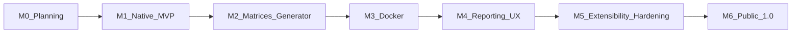

# Roadmap

**Status:** M0–**M6 done** — suite `1.0.0` shipped; see §3 for post-1.0 themes  
**Last updated:** July 2026

---

## 1. Guiding Strategy

Ship vertical slices: each milestone leaves a usable CLI path, not only libraries. Prefer solid methodology over broad surface area.

---

## 2. Milestones

### M0 — Planning

**Objective:** Complete specification and repository scaffolding docs.

**Status:** Done

**Exit criteria:**

- All `docs/*` populated
- README describes vision, layout, and status
- LICENSE present
- Task list ready for implementation ([13_TASKS.md](13_TASKS.md))

---

### Foundation — S1–S3 (complete)

**Objective:** Production-ready project tooling and loaders without benchmark execution.

**Status:** Done

**Deliverables:**

- pnpm + TypeScript strict + Biome + `node:test` via tsx
- Config precedence loader + env redaction
- Profile schema + `validate-profile` CLI
- Errors, logging, DI composition root
- Metrics/reporting/engine interfaces (implementations in later slices)
- CI: lint, typecheck, test, build, CLI smoke

---

### M1 — Native MVP

**Objective:** Run a single-profile native benchmark end-to-end.

**Status:** Done (S4–S9)

**Slices:** S1–S9 in [17_IMPLEMENTATION_PLAN.md](17_IMPLEMENTATION_PLAN.md)

**Deliverables:**

- TypeScript CLI with `doctor`, `validate-profile`, `run`, `version`
- Profile schema v1 + `native-smoke` profile + static fixture
- Native runner with wall-clock metrics
- `run.json` + Markdown summary
- Unit/CLI tests; CI verify includes `native-smoke`

**Exit criteria:**

- Contributor runs `jsbench run --profile native-smoke` on Linux and gets reports — **met**
- CI runs unit/contract tests (+ smoke) — **met**
- Multi-cell matrices and Docker are **out of scope** (clear errors if requested)

---

### M2 — Generator & Matrices

**Objective:** Deterministic workloads and package-manager matrices.

**Status:** Done (S10–S12)

**Slices:** S10–S12 in [17_IMPLEMENTATION_PLAN.md](17_IMPLEMENTATION_PLAN.md)

**Deliverables:**

- Generator for `node-ts-lib` and `nextjs-app` — **done (S11)**
- Size presets `tiny`–`large` — **done**
- Matrix axis: package managers (npm, pnpm, Yarn) — **done (S12)**
- Run-scoped caches for cold installs — **done (S12)**
- Content digests in workspace metadata — **done (S10)**
- Profile `install-build-matrix` + `list-profiles` — **done (S12)**

**Exit criteria:**

- One command produces comparable install/build tables across ≥2 package managers — **met** (`jsbench run --profile install-build-matrix`; optional slow tests)
- Generator digest tests green — **met**

**Next:** S13 Docker runner (M3).

---

### M3 — Docker Runner

**Objective:** Parity stages in Docker with mount modes.

**Status:** Done (S13)

**Slices:** S13 in [17_IMPLEMENTATION_PLAN.md](17_IMPLEMENTATION_PLAN.md)

**Deliverables:**

- Docker runner (`bind`, `named-volume`) — **done**
- Image policy resolution — **done**
- Fingerprint fields for image digest and limits — **done**
- `docker-smoke` profile — **done**
- Optional CI job tagged `docker` — **done** (`workflow_dispatch` input `docker_smoke`)

**Exit criteria:**

- Native vs Docker comparison report for the same profile digest — **supported** (same fixture/profile pattern; run both and compare artifacts)

**Next:** S14 HTML + report diff (M4).

---

### M4 — Reporting Polish

**Status:** Done (S14)

**Objective:** Shareable artifacts and diffs.

**Slices:** S14 in [17_IMPLEMENTATION_PLAN.md](17_IMPLEMENTATION_PLAN.md)

**Deliverables:**

- HTML report — **done**
- `report diff` — **done**
- Citation block in Markdown — **done**
- Log truncation and failure partial reports — **done**

**Exit criteria:**

- Two historical runs can be diffed meaningfully — **supported** (`jsbench report diff`)

**Next:** (complete — see M5/M6).

---

### M5 — Extensibility & Hardening

**Status:** Done (S15–S16)

**Objective:** Plugin interfaces and operational quality.

**Slices:** S15–S16 in [17_IMPLEMENTATION_PLAN.md](17_IMPLEMENTATION_PLAN.md)

**Deliverables:**

- Collector/reporter plugin loading — **done (S15)**
- Additional collectors (`rusage`, `disk-usage`) — **done (S15)**
- Workspace templates for Tailwind / workspace packages — **deferred** (parking lot)
- Security review of shell/docker paths — **done (S16)**
- Performance pass on orchestration overhead — **done (S16)**

**Exit criteria:**

- External plugin sample documented in CONTRIBUTING — **met**
- No known P0 methodology bugs — **met** for shipped paths

**Next:** Post-1.0 themes (§3) or parking-lot items as capacity allows.

---

### M6 — Public 1.0

**Status:** Done (S17–S18)

**Objective:** First stable release suitable for external citations.

**Slices:** S17–S18 in [17_IMPLEMENTATION_PLAN.md](17_IMPLEMENTATION_PLAN.md)

**Deliverables:**

- Schema stability guarantee for v1 — **done** ([18_SCHEMA_COMPATIBILITY.md](18_SCHEMA_COMPATIBILITY.md))
- Built-in calibrated profiles with pinned fixtures — **done** (`profiles/calibrated-digests.json`)
- Full README tutorials / methodology — **done** (S17)
- Tagged GitHub release + changelog — **done** (`v1.0.0`, [14_CHANGELOG.md](14_CHANGELOG.md))

**Exit criteria:**

- Semver `1.0.0` with documented compatibility window — **met**

---

## 3. Post-1.0 Themes (Backlog)

- macOS / Windows runners (methodology adaptations)
- Remote agent mode for lab farms
- Regression gates in CI (threshold diffs)
- Optional result directory format for community leaderboards (still local-first)
- Compose-based multi-service fixtures
- Statistical outlier rules (explicit opt-in)

---

## 4. Priority Principles

1. Methodology correctness &gt; new templates
2. Linux native &gt; Docker &gt; other OS
3. Install + build stages &gt; exotic collectors
4. Schema stability &gt; frequent breaking UX churn

---

## 5. Tracking

Day-to-day implementation tasks live in [13_TASKS.md](13_TASKS.md).  
Commit-sized engineering slices (S0–S18), test gates, and locked kickoff decisions live in [17_IMPLEMENTATION_PLAN.md](17_IMPLEMENTATION_PLAN.md).  
AI agent workflow and Definition of Done: [../AGENTS.md](../AGENTS.md).

Update task status as work proceeds; update this roadmap when milestone scope changes; keep the implementation plan’s slice map in sync.
