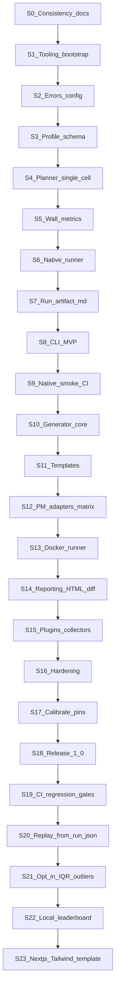

# Implementation Plan

**Status:** Complete through S23 (`nextjs-app-tailwind`); further work from parking lot / roadmap themes  
**Last updated:** July 2026  
**Companion docs:** [12_ROADMAP.md](12_ROADMAP.md) · [13_TASKS.md](13_TASKS.md) · [../AGENTS.md](../AGENTS.md)

---

## 1. Purpose

Break delivery into **small, independently testable milestones**. Each milestone:

1. Leaves the repository **buildable and green** (tests/lint pass for whatever exists).
2. Can be **committed alone** without depending on unfinished later work.
3. Has an explicit **test gate** and **exit criteria**.
4. Avoids half-wired CLI commands that crash when invoked.

This plan refines roadmap milestones **M1–M6** into commit-sized slices **S0–S18**. Roadmap letters (M*) remain the product narrative; slices (S*) are the engineering sequence.

---

## 2. Locked Decisions (unblock M1)

These were previously TBD. They are **locked here** so implementation is not blocked. Change only via an explicit decision-log update.

| Decision | Choice | Rationale |
|----------|--------|-----------|
| Suite package manager | **pnpm** | Fast installs, strict node_modules, common in TS tooling; independent of pms *under test* |
| Layout for M1–M3 | **Single package** under `src/` | Fewer moving parts; extract to `packages/*` only if boundaries hurt |
| CLI binary name | **`jsbench`** | Already used throughout specs |
| Formatter/linter | **Biome** | One tool for format+lint; revisit only if blocked |
| Test runner | **Node.js built-in test runner** (`node:test`) + `tsx` for TS | Minimal deps per dependency policy |
| TypeScript emit | **Compile to `dist/`** for published bin; `tsx` OK for tests/dev | Predictable Node execution |
| File naming | **`kebab-case.ts`** | Matches profile ids and doc convention |
| Test location | **`src/**/*.test.ts` colocated** + `tests/` for integration only | Fast unit feedback |

Record the same rows in [13_TASKS.md](13_TASKS.md) Decisions Log when implementation starts.

---

## 3. Standing Rules (every slice)

### 3.1 Definition of Done (per slice)

- [ ] Scope in this plan completed—no silent scope creep
- [ ] Automated tests listed for the slice are green locally
- [ ] `pnpm lint` / `pnpm test` (or equivalent scripts introduced in S1) pass
- [ ] Docs touched if public CLI/schema behavior changed
- [ ] Changelog `[Unreleased]` updated for user-visible changes
- [ ] No known crash on implemented CLI commands
- [ ] Unimplemented commands either **absent** from `--help` or print a clear “not available until Mx” and exit `0`/`2`—never stack traces

### 3.2 Commit hygiene

- Prefer **one slice → one commit** (or a short stack of commits that each keep `main` green).
- Do not merge a slice that disables CI or leaves `pnpm test` failing.
- Generated `generated/` and `reports/` remain gitignored.

### 3.3 Network policy in CI

- Default CI: **no registry installs of fixture apps**, no Docker.
- Optional jobs: `slow`, `docker`—manual or nightly.

---

## 4. Dependency Graph

---

## 5. Slices

### S0 — Documentation consistency gate (docs only)

**Goal:** Specs agree before code.

**Work:** Already largely done; any remaining cross-links (this plan, overview index).

**Test gate:** Manual doc review checklist; no code.

**Commit:** Docs-only. Repo stays planning-valid.

**Maps to:** M0 closeout · T-M0-09

---

### S1 — Tooling bootstrap

**Goal:** Empty but real TypeScript project that CI can run.

**Status:** Done (part of Foundation)

**Work:**

- Root `package.json` with `jsbench` bin stub pointing at `dist/cli.js` (stub prints version / “not implemented” for other cmds)
- `tsconfig.json` (strict), Biome, pnpm lockfile
- Scripts: `build`, `test`, `lint`, `typecheck`
- GitHub Actions: install frozen lockfile → lint → typecheck → test
- `engines.node` set from Active LTS policy at kickoff (record resolved value in changelog note, not as eternal doc requirement)

**Test gate:**

- `pnpm test` runs at least one trivial assertion
- CI green on Linux

**Must not:** Profile loading, runners, real benchmarks.

**Commit-safe:** Yes—stub CLI only.

**Maps to:** T-M1-01, T-M1-02, part of T-M1-11

---

### S2 — Errors, logging, config precedence

**Goal:** Shared foundations without benchmark logic.

**Status:** Done (part of Foundation)

**Work:**

- `BenchError` hierarchy + exit-code mapping table from architecture
- Env redaction helpers
- Config loader: defaults ← profile placeholders ← `jsbench.config.yaml` ← env ← CLI (CLI parsing can be minimal flags only)
- Unit tests for precedence and redaction

**Test gate:** Unit tests only; no FS benchmarks.

**Must not:** Execute stages.

**Maps to:** T-M1-04 · FR-CFG-*

---

### S3 — Profile schema + validation

**Goal:** Load YAML/JSON profiles and reject invalid ones.

**Status:** Done (part of Foundation)

**Work:**

- JSON Schema for profile `schemaVersion: 1` (M1 subset: optional empty/single matrix)
- `validate-profile` library API + CLI command wired
- Built-in discovery path `profiles/` (may be empty until S9)
- Canonical profile digest (stable hash of normalized doc)

**Test gate:**

- Contract tests: valid fixtures pass; invalid fixtures fail with exit 2
- Digest stability test

**Must not:** Run plans.

**Maps to:** T-M1-03 · FR-PROF-*

---

### S4 — Planner (single-cell / trivial matrix)

**Goal:** Expand a profile into a `RunPlan` without executing it.

**Status:** Done

**Work:**

- `RunPlan` types
- Support profiles with **no matrix** or a matrix that yields **exactly one cell**
- `--dry-run` library path that returns the plan JSON
- Reject multi-cell matrices with a clear error: “multi-cell matrices require M2 / S12”

**Test gate:** Planner unit tests; dry-run snapshot.

**Must not:** Spawn processes.

**Maps to:** T-M1-05 · FR-ENG-01 (limited)

---

### S5 — Metrics: wall + aggregations ✅

**Goal:** Pure metrics math + wall collector interface.

**Status:** Done

**Work:**

- `Collector` interface
- `wall` collector (`process.hrtime.bigint` → `durationMs`)
- Aggregations: count/min/max/mean/median/p95/stdev
- **p95 locked:** nearest-rank (documented in [07_METRICS_ENGINE.md](07_METRICS_ENGINE.md) §6.1)

**Test gate:** Golden aggregation fixtures; wall duration monotonic smoke with `setTimeout`.

**Must not:** Native spawn of package managers.

**Maps to:** T-M1-07 · FR-MET-01, FR-MET-04

---

### S6 — Native process runner ✅

**Goal:** Supervised `spawn` with argv arrays, cwd, timeout, logs.

**Status:** Done

**Work:**

- Process-group kill on timeout (`detached` + `kill(-pid)`)
- Scrubbed env allowlist (`scrubEnv`)
- Capture stdout/stderr to files under a caller-provided log dir
- Toolchain discovery helpers for doctor (`discoverNativeToolchains` — Node/npm)

**Test gate:**

- Integration test: run `node -e "process.exit(0)"` and record duration
- Timeout test: short-timeout sleep → `timeout` status
- No `shell: true` in implementation

**Must not:** Docker; package-manager adapters beyond raw argv passthrough.

**Maps to:** T-M1-06 · FR-NAT-01..03

---

### S7 — Run artifact + Markdown reporter ✅

**Goal:** Persist immutable `run.json` + `summary.md`.

**Status:** Done

**Work:**

- Manifest + `run.json` writer (`writeRunArtifact`)
- Environment fingerprint (OS/CPU/mem/arch/toolchains best-effort)
- Markdown reporter from aggregates (`summary.md`)
- Partial/`failed` status support (`deriveRunStatus`)
- JSON Schema: `schemas/run-artifact.schema.json` (schemaVersion / metricsSchemaVersion = 1)

**Test gate:**

- Golden Markdown from fixture `run.json`
- Schema contract test for `run.json`

**Must not:** HTML/diff (those are S14).

**Maps to:** T-M1-08 · FR-REP-01..02

---

### S8 — CLI MVP wiring ✅

**Goal:** End-to-end orchestration for single-cell native runs.

**Status:** Done

**Work:**

- Commands: `version`, `doctor`, `validate-profile`, `run`, `--dry-run`, `--continue-on-error`
- Engine: validate → plan → workspace → execute `raw.command` stages → metrics → report
- Profile stage fields: optional `command` / `args` for `action: raw.command`
- Exit codes per architecture table (0/2/3/4/6)

**Test gate:**

- CLI tests with fixture profile that runs `node` trivial commands only (no npm install)
- `doctor` returns 0 on CI image with Node

**Must not:** Multi-pm matrix; Docker; `generate` command (stubbed).

**Maps to:** T-M1-09 · FR-CLI subset

---

### S9 — Native smoke profile + CI closeout (M1 exit) ✅

**Goal:** Documented `native-smoke` path; M1 complete.

**Status:** Done

**Work:**

- `profiles/native-smoke.yaml` + static fixture `fixtures/native-smoke/`
- Profile id resolution (`--profile native-smoke`)
- Static workspace seeding when `workload.template` is an existing directory
- README “M1 usage” section
- CI: unit/contract + `native-smoke` in verify; optional `workflow_dispatch` job

**Test gate:**

- `pnpm build && node dist/cli.js run --profile native-smoke` on Linux
- All S1–S8 tests green

**Commit-safe M1 tag candidate:** `v0.1.0` (pre-1.0)

**Maps to:** T-M1-10..12 · Roadmap M1 exit

---

### S10 — Generator core ✅

**Goal:** Deterministic materialize + digest API.

**Status:** Done

**Work:**

- Template manifest loader (`template.manifest.yaml` + JSON Schema)
- Size preset expansion (defaults + per-template overrides; params win)
- Render pipeline (skeleton copy + seeded modules) + `.jsbench-workspace.json`
- Content digest algorithm (sorted paths, `\n` normalize, excluded dirs)
- CLI `generate --template <id> [--size] [--seed] [--out]`
- Minimal template `templates/fixture-lib` for core tests (full templates = S11)

**Test gate:**

- Digest stability (two materializations match)
- Seed change alters digest
- Excluded dirs ignored

**Must not:** Require Next.js install in CI.

**Maps to:** T-M2-01, T-M2-04, T-M2-05 · FR-GEN-*

---

### S11 — Templates: `node-ts-lib` + `nextjs-app` ✅

**Goal:** Real workloads for local/matrix runs.

**Status:** Done

**Work:**

- Both templates with `tiny`–`large` knobs
- Snapshot tests for `tiny` only in CI
- Version resolver: resolve-at-generation + pin into workspace `package.json` (lock strategy from generator doc)

**Test gate:** Snapshot + digest tests offline (pins recorded in template or test doubles for resolver).

**Must not:** Full `next build` in default CI.

**Maps to:** T-M2-02, T-M2-03, T-M2-09

---

### S12 — Package-manager adapters + matrices (M2 exit) ✅

**Goal:** Comparable install/build across ≥2 package managers.

**Status:** Done

**Work:**

- Adapters: npm, pnpm, Yarn Berry (Classic only if explicit profile later)
- Planner: full cartesian matrix
- Run-scoped caches; cold install policy
- `list-profiles` command
- Built-in profile: install+build matrix (`tiny` size for smoke)
- Mark slow tests; document manual run instructions

**Test gate:**

- Unit tests for argv mapping
- Planner matrix expansion tests
- Optional slow job: 2 pms × install only on `node-ts-lib` tiny (`JSBENCH_SLOW_TESTS=1 pnpm test:slow`)

**Maps to:** T-M2-06..10 · Roadmap M2 exit

---

### S13 — Docker runner (M3 exit) ✅

**Goal:** Same stages in Docker with `bind` + `named-volume`.

**Status:** Done

**Work:**

- `doctor` Docker checks
- Image policy resolver
- Mount planner; container lifecycle; exec timing boundaries
- Resource limits + fingerprint fields
- Cleanup policies
- `docker-smoke` profile
- Optional CI workflow `docker` (not default required)

**Test gate:**

- Unit tests with mocked docker CLI
- Manual/optional: native vs Docker same profile digest

**Must not:** Break native-only CI.

**Maps to:** T-M3-* · Roadmap M3 exit

---

### S14 — HTML + report diff (M4 exit) ✅

**Goal:** Shareable reports and comparisons.

**Work:**

- HTML reporter (self-contained)
- `jsbench report` re-render
- `jsbench report diff`
- Citation block; log truncation; partial failure polish
- Golden tests

**Test gate:** Golden HTML/Markdown/diff fixtures.

**Maps to:** T-M4-* · Roadmap M4 exit

---

### S15 — Plugin API + optional collectors (M5 start) ✅

**Goal:** Extensibility without core edits.

**Work:**

- Load collectors/reporters from config paths
- Sample plugin in `docs/` or `examples/`
- `rusage` + `disk-usage` collectors (best-effort; skip gracefully)

**Test gate:** Plugin load unit test; collector tests where OS allows.

**Maps to:** T-M5-01..04

---

### S16 — Hardening (M5 exit) ✅

**Goal:** Security and overhead discipline.

**Work:**

- Shell forbid audit; Docker mount allowlists
- Orchestration overhead measurement note/tooling
- Optional templates (Tailwind / pnpm-workspace) **only if** capacity—each as its own follow-up commit, not a blocker

**Test gate:** Security-oriented unit tests; no P0 methodology bugs open.

**Maps to:** T-M5-05..06 · Roadmap M5 exit (T-M5-07 deferred at the time; Tailwind landed in S23)

---

### S17 — Calibration & pins (M6 start) ✅

**Goal:** Publishable built-in profiles.

**Work:**

- Pin fixture deps; refresh digests
- Methodology notes in README
- Schema compatibility statement draft

**Test gate:** Re-baseline goldens; dry-run all built-in profiles.

**Maps to:** T-M6-01..03

---

### S18 — Release 1.0.0 (M6 exit) ✅

**Goal:** Tagged stable release.

**Work:**

- Changelog release section
- Git tag `v1.0.0`
- Optional npm publish

**Test gate:** Full default CI green; manual smoke native (+ Docker if available).

**Maps to:** T-M6-04..05

---

### S19 — CI regression gates (post-1.0) ✅

**Goal:** Fail CI (or local scripts) when a report diff exceeds explicit thresholds.

**Work:**

- `evaluateRegressionGate` on median deltas (percent and/or absolute)
- `jsbench report diff --fail-on-regression` (+ threshold / metric / digest flags); exit code **7**
- Deterministic CI smoke using fixture `run.json` copies
- Docs: reporting + architecture exit codes

**Test gate:** Unit tests for gate logic; CLI tests for exit 0/7; default CI green.

**Maps to:** T-POST-01

---

### S20 — Replay from historical `run.json` (post-1.0) ✅

**Goal:** Automate reproduction hints (and optional re-execution) from a prior run artifact.

**Work:**

- `buildReplayPlan` — toolchain `exact:` hints, profile id/digest, suggested commands
- `jsbench replay <runDir|--from path>` (hints JSON)
- `jsbench replay --execute` with digest check (`--force` to override)
- CI smoke: hints mode against the verify-job native-smoke output

**Test gate:** Unit tests for plan builder; CLI tests for hints / digest mismatch / matching execute.

**Maps to:** T-POST-02

---

### S21 — Opt-in IQR outlier rules (post-1.0) ✅

**Goal:** Explicit, documented outlier filtering — never silent.

**Work:**

- Profile `metrics.outlierRule: none|iqr` (optional; default none)
- Tukey 1.5×IQR with nearest-rank Q1/Q3; skip groups with &lt;4 samples
- `run.json` `outlierFilter.dropped[]` + warnings; raw `results` unchanged
- Markdown notes when drops occurred

**Test gate:** Unit tests for IQR keep/drop/skip; existing goldens unchanged (built-ins stay `none`).

**Maps to:** T-POST-03

---

### S22 — Local-first leaderboard directory (post-1.0) ✅

**Goal:** Optional shareable result index for community comparison — still local-first, no upload, no winners.

**Work:**

- `schemas/leaderboard.schema.json` + Ajv validation
- `buildLeaderboard` / `renderLeaderboardMarkdown` (entries sorted by `runId`, not by performance)
- Discover `run.json` under `--from` (default: config `outputDir`); write `leaderboard.json` + `leaderboard.md` under `--out` (default: `./leaderboard`)
- CLI: `jsbench leaderboard [--from] [--out] [--metric]` (default metric `durationMs`)
- Disclaimer: not a ranking; compare same profile digest

**Test gate:** Unit + CLI tests; schema validation of written JSON.

**Maps to:** T-POST-04

---

### S23 — `nextjs-app-tailwind` template (T-M5-07 partial) ✅

**Goal:** Optional Next.js + Tailwind CSS v4 workload for install/typecheck/build matrices that exercise CSS tooling.

**Work:**

- Template `templates/nextjs-app-tailwind/` (`kind: application`, sizes mirrored from `nextjs-app`)
- Tailwind v4 via `@import "tailwindcss"` + `@tailwindcss/postcss` + `postcss.config.mjs`
- Offline pins: `tailwindcss`, `@tailwindcss/postcss`, `postcss` in `resolved-versions.json`
- Tiny snapshot + calibrated digest (`nextjs-app-tailwind@tiny@1`)
- **Not in this slice:** `pnpm-workspace` (remains parking lot)

**Quality notes (post-S23 gate):**

- Generated home `<h1>` uses `jsbench-<templateId>` (shared `renderNextAppTree`); `nextjs-app` digest unchanged
- No built-in profile exercises this template yet; default CI does not run `next build`
- Suggested follow-ups: optional profile for Tailwind matrices; `pnpm-workspace` (T-M5-07 remainder); or parking-lot `docker-stats` / Compose / Windows-macOS

**Test gate:** Snapshot inventory + digest; no `next build` in default CI.

**Maps to:** T-M5-07 (partial)

---

## 6. Milestone ↔ Slice Map

| Roadmap | Slices | Ship tag (suggested) |
|---------|--------|----------------------|
| M0 | S0 | docs |
| M1 | S1–S9 | `v0.1.0` |
| M2 | S10–S12 | `v0.2.0` |
| M3 | S13 | `v0.3.0` |
| M4 | S14 | `v0.4.0` |
| M5 | S15–S16 | `v0.5.0` |
| M6 | S17–S18 | `v1.0.0` |
| Post-1.0 | S19–S23+ | minor bumps as needed |

---

## 7. What “not broken” means between slices

| After slice | User-visible state |
|-------------|-------------------|
| S1 | `jsbench version` works; other commands may say unimplemented |
| S3 | `validate-profile` works on fixtures |
| S8–S9 | Full native smoke path works |
| S12 | Matrices work; Docker still unsupported (clear error) |
| S13 | Docker profiles work when daemon present |
| S14 | HTML/diff available |
| S15 | Plugins + optional collectors |
| S16 | Hardening (shell forbid, mount allowlist, overhead helper) |
| S17 | Calibrated pins/digests + schema compatibility draft |
| S18 | 1.0 supported surface frozen |
| S19 | `report diff --fail-on-regression` (exit 7) |
| S20 | `replay` hints + optional `--execute` |
| S21 | Opt-in `outlierRule: iqr` with explicit drops |
| S22 | Local `jsbench leaderboard` index (no upload / no winners) |
| S23 | `nextjs-app-tailwind` template (Tailwind v4 pins) |

Never leave `jsbench run` registered if it throws because reporter/runner imports are missing—wire commands only when their stack exists, or guard with feature flags.

---

## 8. Explicit Non-Goals for Early Slices

- Windows/macOS support
- Compose multi-service stacks
- Automatic outlier removal (silent); opt-in `outlierRule: iqr` is supported (S21)
- Hosted result upload (local leaderboard index is supported — S22)
- Claiming package-manager winners in output copy

---

## 9. Suggested First Implementation Week

1. Commit S1 (tooling + CI)  
2. Commit S2 (errors/config)  
3. Commit S3 (schema)  
4. Commit S4 (planner)  
5. Commit S5–S6 (metrics + native runner)  
6. Commit S7–S9 (reports + CLI + smoke) → **M1 done**

Stop after documentation updates in the current change set; begin S1 only when maintainers open implementation.
